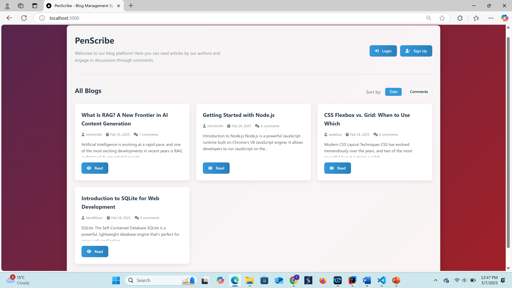
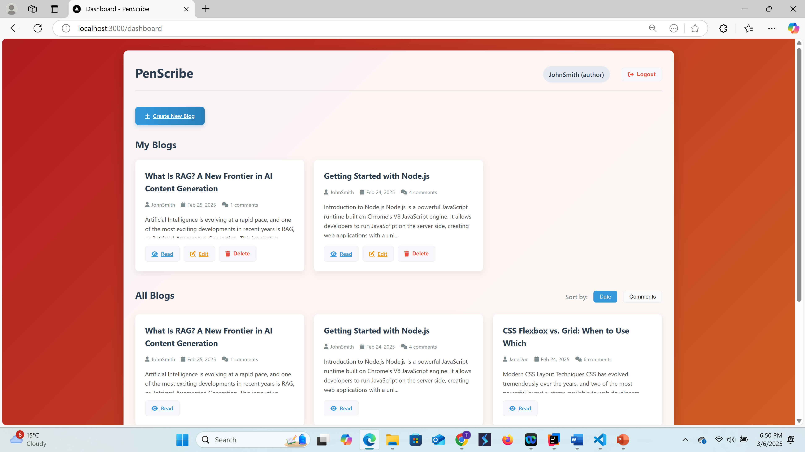

# PenScribe Blog Management System

[](https://penscribe-blog-management-system.onrender.com/)
[](LICENSE)

A full-featured blog management system built with Node.js, Express, and SQLite that allows authors to create and manage blog content while enabling readers to engage through comments and replies.

## ✨ Live Demo

Visit the live application: [PenScribe Blog System](https://penscribe-blog-management-system.onrender.com/)

**Default Admin Credentials:**
- Email: admin@example.com
- Password: admin123

## 📸 Screenshots

<details>
<summary>Click to view screenshots</summary>

### Landing Page


### Login Page


### Sign Up Page


### Author Dashboard


### Reader Dashboard


### Create Blog


### Edit Blog


### View & Read Blog


</details>

## 🚀 Features

### Authentication & Authorization
- User registration and login system
- Role-based access control (Authors and Readers)
- JWT-based authentication with secure HTTP-only cookies
- Password hashing using bcrypt

### Blog Management
- Create, edit, and delete blog posts (Author role)
- Rich text editing for blog content
- View blogs by date or popularity (comment count)
- Responsive design for all devices

### Commenting System
- Add comments to blogs with optional image attachments
- Nested replies (reply to comments or other replies)
- Like functionality for comments
- Edit and delete your own comments and replies

### Security Features
- SQL injection prevention with parameterized queries
- XSS protection with HTML escaping
- CSRF protection
- Input validation

## 💻 Technology Stack

### Backend
- **Node.js** - JavaScript runtime
- **Express** - Web framework
- **SQLite** - Database
- **JWT** - Authentication tokens
- **bcrypt** - Password hashing

### Frontend
- **HTML5/CSS3** - Structure and styling
- **JavaScript** - Client-side functionality
- **Font Awesome** - Icons
- **Responsive Design** - Mobile-friendly interface

## 🛠️ Installation & Setup

### Prerequisites
- Node.js (v14+)
- npm or yarn

### Local Development
1. Clone the repository
   ```bash
   git clone https://github.com/tusharranjan007/PenScribe---blog-management-system.git
   cd PenScribe---blog-management-system
   ```

2. Install dependencies
   ```bash
   npm install
   ```

3. Start the development server
   ```bash
   node src/server.js
   ```

4. Access the application at `http://localhost:3000`

## 📁 Project Structure

```
blog_management_system/
├── src/
│   ├── server.js          # Express server setup and routes
│   └── database.js        # Database configuration and queries
├── public/                # Static files (HTML, CSS, client-side JS)
│   ├── index.html         # Landing page
│   ├── login.html         # Login page
│   ├── signup.html        # Registration page
│   ├── dashboard.html     # User dashboard
│   ├── create-blog.html   # Blog creation page
│   ├── edit-blog.html     # Blog editing page
│   ├── view-blog.html     # Blog reading page
│   └── styles.css         # Global styles
├── images/                # Screenshots for documentation
├── blog_system.db         # SQLite database file
└── package.json           # Project metadata and dependencies
```

## 🔒 Security Implementation

- **Password Security**: bcrypt with salt rounds of 10
- **Authentication**: JWT tokens stored in HTTP-only cookies
- **SQL Injection Prevention**: Parameterized queries
- **XSS Prevention**: Content sanitization and HTML escaping
- **Authorization**: Role checks and content ownership verification

## 🌟 Why This Technology Stack?

- **SQLite**: Perfect for this application due to its self-contained nature, zero configuration, and strong support for relational data with minimal overhead
- **Node.js/Express**: Provides a lightweight and efficient server environment with excellent async processing capabilities
- **JWT Authentication**: Enables stateless, secure authentication with minimal overhead
- **Promise-based Database Operations**: Cleaner, more maintainable asynchronous code

## 📋 Usage

1. **Register** an account as either an Author or Reader
2. **Login** with your credentials
3. **Authors** can create, edit, and delete their own blogs
4. **Readers** can browse all blogs and interact through comments
5. Both roles can engage in discussions through nested comments and replies

## 📝 License

This project is licensed under the MIT License - see the LICENSE file for details.

## 🤝 Contributing

Contributions, issues, and feature requests are welcome! Feel free to check issues page.

## 👤 Developers

- Tushar Ranjan
